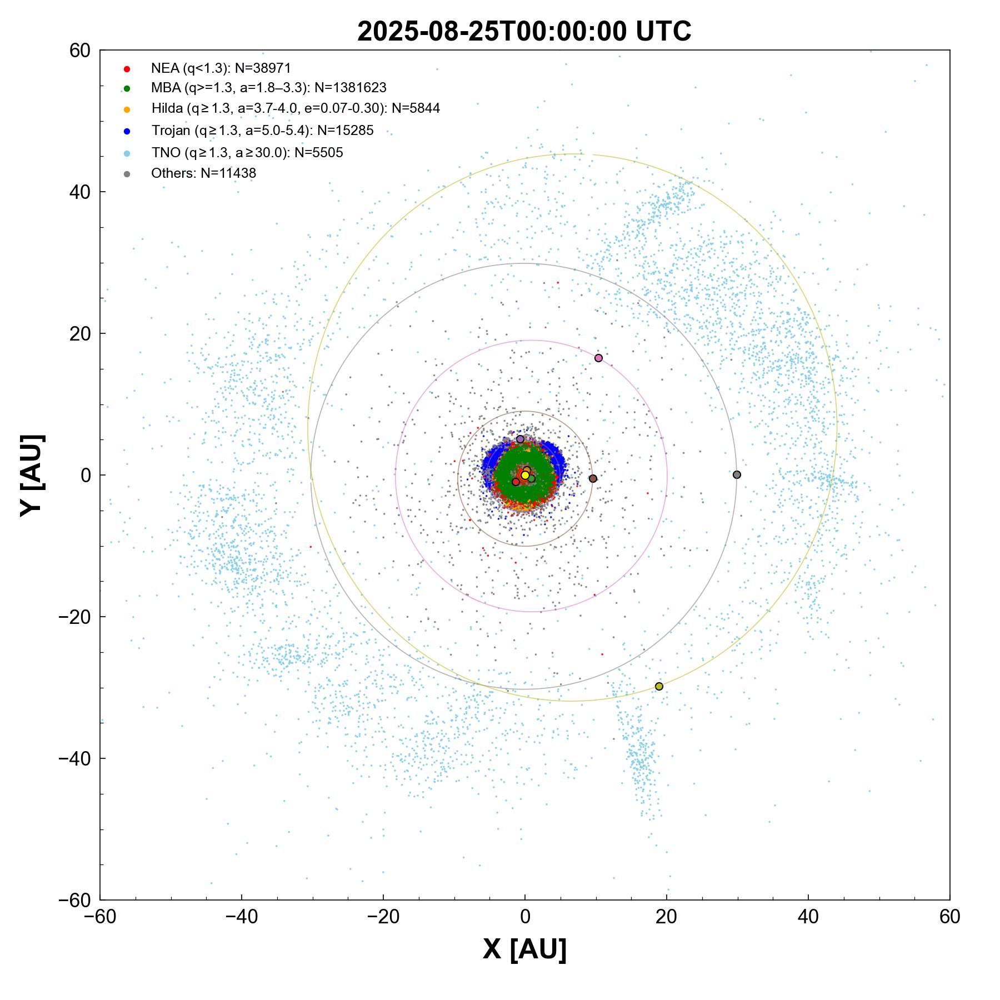
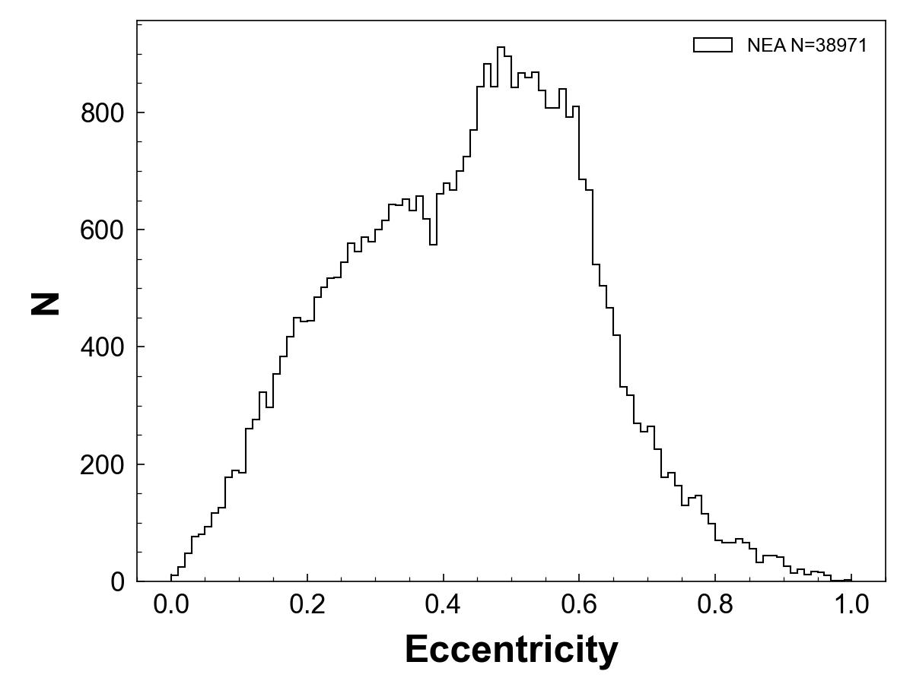
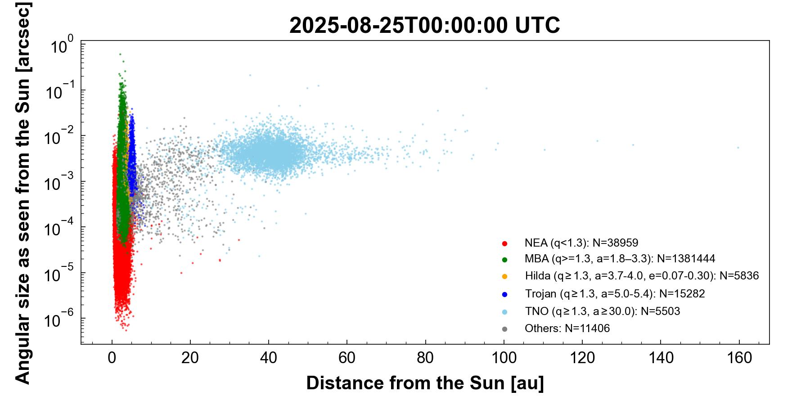

# Minor Planet Painter 
[](https://opensource.org/licenses/MIT)

[developer mail](mailto:jbeniyama@oca.eu)

## Overview
A Python library for plotting and visualizing minor planets


## Structure
```
./
  data/
  fig/
  minor_planet_painter/
    common.py
    ...
  scripts/
    plot_sssb_xy.py
    ...
  .gitignored
  README.md
```

## Make figures
0. Obtain datasets from MPC
``` 
# Orbital elements of all minorplanets (MPCORB.DAT) and NEAs (NEAm00.txt) are saved in ./data
wget_MPCORB_NEA.sh
```

1. Spatial distribution of minor bodies
```
# Plot all minor planets (output figure is shown below)
plot_sssb_xy.py 2025-08-25 --range 60
# Plot all minor planets, only inner system
plot_sssb_xy.py 2025-08-25 --range 6

# Plot all minor planets specifying the input file
plot_sssb_xy.py --MPCORB MPCORB_original.DAT
```




2. Orbital elements of minor bodies
```
# Plot only NEAs (output figure is shown below)
plot_sssb_orbelem.py --onlyNEA

# NEA pairs (in prep)
```




3. Angular distance of minor bodies
```
# Plot all minor planets (output figure is shown below)
# Not that this is from the Sun, not the Earth.
plot_sssb_angsize.py 2025-08-25 --out angsize_20250825.jpg
```



4. Sky motion of minor bodies
```
# Plot all minor planets (output figure is shown below)
# It takes a few minutes for only 500 bodies
plot_sssb_skymotion.py --out skymotion_20250825.jpg --Nobj 500
```
<p align="center">
  <br>
  <em>Sky motion of minor bodies. The NEA with a semimajor axis of about 1 is (99942) Apophis.</em>
</p>


## Installing
```
git clone git@github.com:jinbeniyama/minor-planet-painter.git
```
